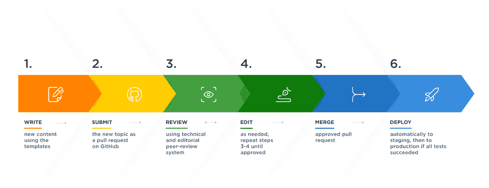

## About DocsKit

DocsKit is an open-source tool that simplifies the way documentation is created, managed, and delivered. It provides teams with a comprehensive set of features and technical foundations to streamline their documentation workflow, resulting in enhanced performance, accessibility, and sustainability.

### DocsKit, how it is different from Gatsby?

The user needs only to upload documentation in the docs folder as MDX files.

Part of the magic happens based on [Gatsby shadowing](https://www.gatsbyjs.com/docs/how-to/plugins-and-themes/shadowing/).

In a nutshell Gatsby lets you use your own code/content without overwriting the themes original files.

For example:

> In this case, the file to shadow is gatsby-theme-blog/src/components/bio.js.

> The shadowing API uses a deterministic file structure to determine which component will be rendered. In order to override the Bio component in gatsby-theme-blog, create a file named user-site/src/gatsby-theme-blog/components/bio.js.

> Any file that lives in the src/gatsby-theme-blog directory of the user’s site will be used instead of a file with the same name located in the theme’s src directory: gatsby-theme-blog/src. This replaces the entire file: to re-use parts of the original file from the theme such as functionality or styling, check out the sections of this doc on extending and importing shadowed files.

> This means that user-site/src/gatsby-theme-blog/components/bio.js will be rendered in place of gatsby-theme-blog/src/components/bio.js.

Under the hood DocsKit uses the below custom plugins:

[@platformos/gatsby-theme-platformos-docskit](https://www.npmjs.com/package/@platformos/gatsby-theme-platformos-docskit)

This plugin has the necessary plugins and configuration already included for DocsKit to work.

[@platformos/gatsby-plugin-posify](https://www.npmjs.com/package/@platformos/gatsby-plugin-posify?activeTab=readme)

This plugin is used to create the required file structure for a PlatformOS deployment.

`npm run develop --prefix src` is the command to initiate the dev server. The *-- prefix* part indicates npm where it should look for the package.json file.

### Workflow

[DocsKit workflow documentation](https://docskit-preview.staging.oregon.platform-os.com/docskit/editorial-workflow/)

DocsKit works based on the Docs as Code principle.

The documentation is provided in markdown files and submitted as pull request on Github.

The pull request and documentation can be reviewed by the Approver and edited as many times as required by the Developer or Tech writer before the merge and deploye stages. 

Approved and merged requests will be deployed automatically to a Staging (sometimes called UAT [User Acceptance Testing]) environment.

If the tested application is without errors and sanctioned, it can be deployed to production environment manually.

### Deployment to a PlatformOS instance

Deployment requires the configuration of the Github Workflow (actions and secrets).

1. Go to the repo on Github
2. Select Settings -> Security (on the left sidebar) -> Secrets and variables -> In the dropdown select actions
3. 

> This workflow runs automatically for every Pull Requests opened for the master branch. It builds the PR version and deploys it to a preview environment.
deploy_to_qa: This workflow runs automatically when you merge a PR to the master branch, deploying the latest stable version to the QA/UAT environment
deploy_to_production: You can run this workflow manually to deploy the latest master branch to production
You need to set up the following github secrets for your workflows:

> MPKIT_EMAIL: The email assigned to your Partner Portal user
MPKIT_TOKEN: Your partner portal access token
MPKIT_PREVIEW_URL: The instance url for your PREVIEW instance
MPKIT_QA_URL: The instance url for your QA instance
MPKIT_PROD_URL: The instance url for your PRODUCTION instance
You also need to set up these environment variables for your workflow:

> PREVIEW_ASSET_PREFIX: The full asset url for your PREVIEW instance 
QA_ASSET_PREFIX: The full asset url for your QA instance
PROD_ASSET_PREFIX: The full asset url for your PRODUCTION instance 

<Message variant="info" filled>
  Please note PREVIEW_ASSET_PREFIX has to be in the variables page!
  Also important that the CDN url for the instance is generated dynamically, so to set it, you have to open the liquid evaulator (after running pos-cli gui serve on the instance) and input *"" | asset_url*!
</Message>

4. Once configured a pull request will trigger the automation. The automation will accordingly the .github folder file content applications and dependencies will be installed and the DocsKit build follows.

