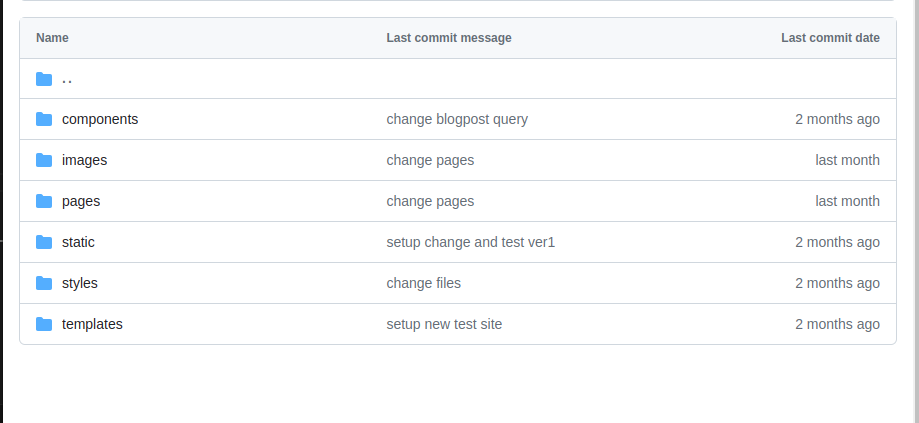
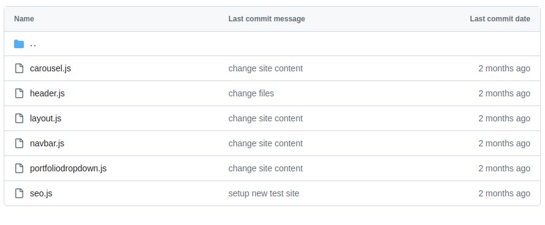

# About Gatsby

Gatsby is a React based static site generator with focus on performance.


<Card variant="highlighted" hoverable>
 *What is a static site generator?*
 
 The static site generator is an application to create HTML pages from templates or other components. 
 Gatsby does not require a backend database, but data thanks to GraphQl integration can be pulled from a vide variety of databases.
 Information is compiled into static files during the build process.
</Card>


Key focus points of Gatsby:
- performance
- good documentation
- strong plugin ecosystem and active communitiy
- security
- cms integration

## Performance

Gatsby is a performance-focused development tool, it uses server side rendering allowing faster display of pages even with slower internet.
Gatsby uses image optimazation, lazy loading, GraphQL to query specific data, code splitting.

## Good documentation

[Quickstart Gatsby](https://www.gatsbyjs.com/docs/quick-start/)

[How to guides of Gatsby](https://www.gatsbyjs.com/docs/how-to/)

## Plugins

[Plugins](https://www.gatsbyjs.com/plugins/)

Gatsby has more than 3000 plugins available, and a large and active community of developers.
Once installed plugins needs to be added in the gatsby-config.js file or configured there accordingly.
It is important, that Gatsby can only work certain feaures with plugins installed and configured. For example MDX file integration requires gatsby-plugin-mdx.
Gatsby can have Themes (preconfigured functionality, data sourcing and other features) based on plugins.
Gatsby Starters are preconfigured for a specfic reason (blogging, portfolio etc).

## Security

[Security in Gatsby](https://www.gatsbyjs.com/docs/conceptual/security-in-gatsby/)

Gatsby builds the application into static files, which provide less opportunitiy for attacks.

## CMS integration

Gatsby can handle multiple types of CMS (Content management system):

- Headless CMSs: Decap CMS (formerly known as Netlify CMS) Contentful, DatoCMS, Prismic, Contentstack, Sanity and Strapi
- Full-stack CMSs: Drupal and WordPress
- E-commerce platform: Shopify

### Gatsby folder structure

```

|-- /.cache
|-- /plugins
|-- /public
|-- /src
    |-- /api
    |-- /pages
    |-- /templates
    |-- html.js
|-- /static
|-- gatsby-config.js
|-- gatsby-node.js
|-- gatsby-ssr.js
|-- gatsby-browser.js

```



## Gatsby code

Gatsby code is based on React, and requires React and ReactDOM as default installed (it does this automatically).

### Components

In React the developer can create components (chunck of reusable code), and this option is also available in Gatsby.
Based on the atomic design, the developer can have multiple components separately like navbar, header, footer all joined together in a layout component. Thus everything can be handeled flexible, and be changed as needed, added or removed as required just like playing with Lego.



### Import and export

Components needs to be exported in their own file so after that Gatsby can import them linkig each together.

Example code below:

```
import * as React from "react";
import { Link, graphql } from "gatsby";
import Layout from "../components/layout";
import { StaticImage } from "gatsby-plugin-image";
import Seo from "../components/seo";
import MyQuote from "../pages/blog/quote";      <!--- Importing the components and Gatsby plugin functionality --->

const IndexPage = ({ data }) => {                <!--- Defining the main index page function, which has all the functionality required in itself --->


  const mdxNodes = data.allMdx.nodes;
  const markdownNodes = data.allMarkdownRemark.edges.map(edge => edge.node);

  const allNodes = [...mdxNodes, ...markdownNodes];

  return (                                         <!--- Below this line code will be rendered --->
    <main pageTitle="Home Page">
      <Layout>                                  <!--- Layout is imported and code below will be placed into the layout format which is described in the layout.js component --->
        <h1 className="text-3xl font-bold">Welcome to my blog!</h1>
        <p className="mt-4">This is a test.</p>

        <hero>
          <div className="grid grid-cols-1 md:grid-cols-2 gap-6 mt-8 md:mt-40 mb-8 md:mb-40">
            <div>
              <StaticImage
                alt="Beautiful mountain landscape with trees"
                src="../images/mountain.jpg"
                placeholder="blurred"
                className="rounded-xl shadow-md"
              />
            </div>
            <div>
              <MyQuote className="transition-opacity animate-pulse" />
            </div>
          </div>
        </hero>

        <div className="grid grid-cols-1 md:grid-cols-2 gap-6">
        {allNodes.map(node => (
          <article
            className="bg-white rounded-xl shadow-md overflow-hidden"
            key={node.id}
          >
            <div className="p-6">
              <h2 className="text-blue-500 font-extrabold text-3xl mb-4">
                <Link to={`/blog/${node.frontmatter.slug}`}>                           <!--- GraphQl query can be used for displaying list of blog entries --->
                  {node.frontmatter.title}
                </Link>
              </h2>
              <p className="text-sm text-gray-500 mb-2">
                Posted: {node.frontmatter.date}
              </p>
              <p className="text-base mb-6">{node.excerpt || node.node.excerpt}</p>
              <hr />
            </div>
            </article>
          ))}
        </div>
      </Layout>
    </main>
  );
};

export const query = graphql`                                   <!--- You can include the GraphQL query also, it wont be rendered. --->
  {
    allMdx(sort: { frontmatter: { date: DESC } }) {
      nodes {
        frontmatter {
          date(formatString: "MMMM D, YYYY")
          title
          slug
        }
        id
        excerpt
      }
    }
    allMarkdownRemark {
      edges {
        node {
          frontmatter {
            date
            slug
            title
          }
          excerpt
        }
      }
    }
  }
`;

export const Head = () => <Seo title="Home Page" />;

export default IndexPage;                                                      <!--- The IndexPage needs to be exported --->

```


## Local dev server

Gatsby comes with a built in local development server, which uses hot reload, so you can see changes made to the code instantly.

` npm run develop or gatsby develop ` command will initiate the dev server by making a local build of files by webpack.

The local dev server runs under **http://localhost:8000**

Neat feature is the built in GraphQl interface called GraphicQL which you can access by **http://localhost:8000/___graphql**


### Deploying the site to Netlify

Netlify can host the Gatsby app you created. Deploying the application needs only to have a Netlify account registered and setup properly.
Netlify keeps track of the Github repository and either does automatic deployment on the repo change or it can be set to have this feautre locked and deploy can be triggered manually.

Atuomatic deployment workflow is suitable with CMS added where users can add content and the deployment follows.

[Netlify documentation](https://docs.netlify.com/)

Example goofy website deployed to Netlify
[Example site](https://sparkly-frangollo-ac026f.netlify.app/)

### Gatsby videos on youtube

Recommended Gatsby videos:

- [Traversy media Gatsby JS crash course 1 hour](https://youtu.be/6YhqQ2ZW1sc?si=cC67B82oY98xrc7_)
- [FreeCodeCamp Gatsby course 9h](https://youtu.be/RaTpreA0v7Q?si=k_HgHKYjlqoDD6-I)